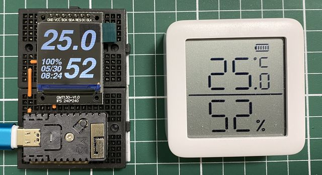

# SwitchBotMeterViewer

## 概要

SwitchBot温湿度計よりデータを読み出し表示する<BR>
FreeSansBoldObliqueのフォントをASCIIコード0x20,0x2E-0x3Aだけ、92ptで登録しています<BR>

## ハードウェア構成

・M5Stamp C3 Mate<BR>
・1.3インチ240x240ディスプレイモジュール(ドライバIC:ST7789)<BR>

 ## 配線

ブレッドボード上で結線しやすいように、ディスプレイとの接続を下記の通りにしています。
```
#define DISP_SCL 10
#define DISP_SDA 8
#define DISP_RES 7
#define DISP_DC  6
#define DISP_BLK 5
```


## 動作環境

PlatformIO

```
Processing esp32-c3-devkitm-1 (platform: espressif32@4.3.0; board: esp32-c3-devkitm-1; framework: arduino)
----------------------------------------------------------------------------------------------------------------------------------------------------------------------------------------------------------------Verbose mode can be enabled via `-v, --verbose` option
CONFIGURATION: https://docs.platformio.org/page/boards/espressif32/esp32-c3-devkitm-1.html
PLATFORM: Espressif 32 (4.3.0) > Espressif ESP32-C3-DevKitM-1
HARDWARE: ESP32C3 160MHz, 320KB RAM, 4MB Flash
DEBUG: Current (cmsis-dap) External (cmsis-dap, esp-prog, iot-bus-jtag, jlink, minimodule, olimex-arm-usb-ocd, olimex-arm-usb-ocd-h, olimex-arm-usb-tiny-h, olimex-jtag-tiny, tumpa)
PACKAGES:
 - framework-arduinoespressif32 @ 3.20003.0 (2.0.3)
 - tool-esptoolpy @ 1.30300.0 (3.3.0)
 - tool-mkfatfs @ 2.0.1
 - tool-mklittlefs @ 1.203.210628 (2.3)
 - tool-mkspiffs @ 2.230.0 (2.30)
 - toolchain-riscv32-esp @ 8.4.0+2021r2-patch3
LDF: Library Dependency Finder -> https://bit.ly/configure-pio-ldf
LDF Modes: Finder ~ chain, Compatibility ~ soft
Found 33 compatible libraries
Scanning dependencies...
Dependency Graph
|-- LovyanGFX @ 0.4.17
|   |-- SPI @ 2.0.0
|   |-- Wire @ 2.0.0
|-- ESP32 BLE Arduino @ 2.0.0
|-- WiFi @ 2.0.0
Building in release mode
Compiling .pio\build\esp32-c3-devkitm-1\src\main.cpp.o
Linking .pio\build\esp32-c3-devkitm-1\firmware.elf
Retrieving maximum program size .pio\build\esp32-c3-devkitm-1\firmware.elf
Checking size .pio\build\esp32-c3-devkitm-1\firmware.elf
Advanced Memory Usage is available via "PlatformIO Home > Project Inspect"
RAM:   [==        ]  15.1% (used 49620 bytes from 327680 bytes)
Flash: [==========]  96.1% (used 1259110 bytes from 1310720 bytes)
Building .pio\build\esp32-c3-devkitm-1\firmware.bin
```

## 参考リンク

https://qiita.com/takeru@github/items/f42381e8482c3bf484e7<BR>
https://github.com/tanakamasayuki/M5StickC-examples/tree/master/other/M5StampPico/LGFX_Config_Template<BR>
https://github.com/lovyan03/LovyanGFX<BR>
https://github.com/tanakamasayuki/u8g2_font_ilfont<BR>
